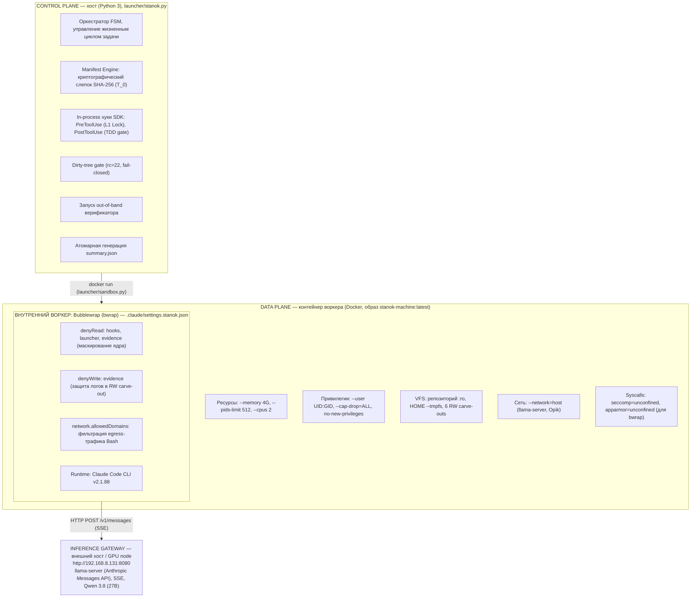
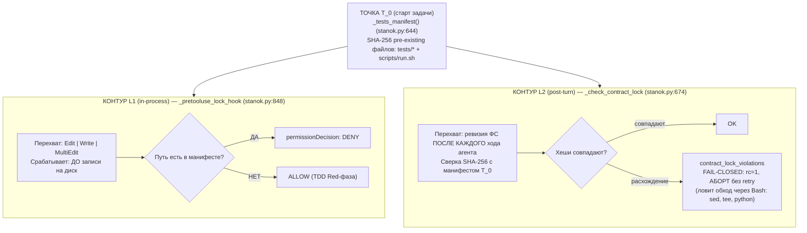

# stanok — a Claude Code machine on a local model

An autonomous "machine": takes a text ticket, solves it in a single TDD session
(monolithic — no subagents) under deterministic hooks and a Docker container
boundary (with the claude-code native bwrap sandbox running inside it),
runs tests through the project's own `scripts/run.sh`, and outputs the result
to `evidence/<label>/summary.json`.

This is infrastructure. The project code (`src/`, `tests/`, `docs/`) and the tickets
live in the parent repo (see the README one level up). This repo is a
pluggable git submodule for any project.

## Requirements

- Docker (the machine boundary; the image bakes in Node.js + Claude Code
  CLI 2.1.88 — hermetic, no host bind-mounts), whatever runtime the
  project's `scripts/run.sh` uses
- A local llama-server, Anthropic-compatible (`STANOK_SERVER_URL`)
- The parent repo must NOT contain a `CLAUDE.md` above this repo
  (the control-room role is set via `--append-system-prompt-file`,
  otherwise the machine auto-loads the parent CLAUDE.md — role leak)

## Setup

```bash
./setup.sh                                   # .venv + claude-agent-sdk + CLI staging + docker image build
bash hooks/doctor.sh                         # all doctor checks must pass (pytest)
uv run --directory . pytest launcher/tests_harness --collect-only -q | tail -1  # check count
```

## Running

```bash
./launch.sh run <ticket.md> <label> [--background|--direct] [--local-retries N] [-- extra...]
# `run` is optional: `./launch.sh <ticket.md> <label> ...` is equivalent.
# The ticket is resolved against three bases (project root -> machine root -> as given),
# so the canonical call from the project root is: `./stanok/launch.sh tickets/x.md <label>`.
# The shim cd's into the machine root (the directory containing launch.sh):
# the call works from any cwd; --background with a nonexistent ticket fails
# immediately (rc=13) instead of spawning a dead detach.
./launch.sh status <label>      # JSON: running/dead/done/missing
./launch.sh stop <label>        # interrupt the run (TERM by pid from .running)
```

- `--background` — detach to the background (observe: `tail -f /tmp/stanok-logs/<label>.launch.log`)
- `--direct` — headless directly, ticket path relative to the repo
- `--local-retries N` — in-session retry turns on verifier FAIL (default 2)

## Structure

```
launcher/stanok.py            — THE single Runner (CLI run/status/stop,
                                gates, background self-spawn, Job/Attempt,
                                typed summary.json)
launcher/sandbox.py           — the Docker boundary (R2, former sandbox-run.sh):
                                repo mounted read-only with writable carve-outs
                                (src/, tests/, docs/, scripts/, evidence/);
                                .git read-only; cap-drop=ALL, no-new-privileges,
                                resource limits
launch.sh                     — thin shim: exec venv-python launcher/stanok.py
Dockerfile                    — the machine image (debian + toolchain +
                                uv + claude-agent-sdk + pytest + Node.js +
                                Claude Code CLI 2.1.88 + bubblewrap + socat
                                + jq)
hooks/                        — doctor (thin pytest wrapper, R5; the TDD
                                verifier is in-process in
                                launcher/stanok.py, R1)
launcher/tests_harness/       — the doctor checks as pytest (R5)
.claude/settings.stanok.json  — the machine config (allow/deny,
                                native sandbox + allowedDomains)
CLAUDE.md                     — the machine role (auto-loaded inside the repo)
setup.sh                      — environment deployment (.venv + docker image)
src/ tests/ docs/ scripts/    — the machine working directories (empty at start)
```

## Configuration (all via env)

| Variable             | Default                   | What it sets                     |
|----------------------|---------------------------|----------------------------------|
| `STANOK_SERVER_URL`  | `http://127.0.0.1:8080`   | llama-server                     |
| `STANOK_MODEL`       | `Qwen3.8-27B-MTP`         | local model                      |
| `STANOK_CLAUDE_BIN`  | `claude` (from PATH)      | claude-code binary               |
| `STANOK_PY`          | `<repo>/.venv/bin/python` | python for the Runner (host-side; remapped to the image python inside the container) |
| `STANOK_REPO`        | `<repo>/stanok`           | machine root (override)          |
| `STANOK_EVIDENCE`    | `<repo>/evidence`         | evidence dir (summary.json, logs) |
| `STANOK_LOCAL_RETRIES` | `2`                     | in-session retry turns on verifier FAIL |
| `STANOK_REQUIRED_WINDOW` | `CLAUDE_CODE_AUTO_COMPACT_WINDOW` from settings | preflight: minimal server `n_ctx` (rc=20 if less) |
| `STANOK_SKIP_SERVER_CHECK` | unset                   | `1` — skip the preflight `/props` check entirely |
| `STANOK_OPIK_URL`      | `http://localhost:8080` | Opik backend (trace-count check) |
| `STANOK_DOCKER_IMAGE`| `stanok-machine:latest`   | the machine image                |
| `STANOK_CONTAINER_MEM` | `4g`                    | container memory limit           |
| `STANOK_CONTAINER_PIDS`| `512`                   | container pids limit             |
| `STANOK_CONTAINER_CPUS`| `2`                     | container CPU limit              |

## How it works (briefly)

1. `launch.sh` (thin shim → Runner) — the Runner passes the fail-closed
   gates in this order: label-guard (rc=15) -> ROLE-LEAK (rc=24) ->
   ticket (rc=13) -> dirty-tree (rc=22, uncommitted changes — start
   forbidden) -> then: `--background` spawns a detached self-run, or sync
   runs either in-process (host no-sandbox / container side — the lock
   (rc=21) is taken there) or as a supervised `docker run`
   (`launcher/sandbox.py`; the container-side Runner re-runs the gates and
   takes the lock). The image preflight (the image LABEL `stanok.digest`
   must equal sha256(Dockerfile + scripts/run.sh) and every stack's
   preflight command must succeed inside the image, `docker run --rm`)
   no longer blocks the launch path (CC-106) — it runs in doctor
   (`test_docker_image_digest_matches`): a stale image is a doctor failure,
   not a mid-run ENV-FAIL -> ticket header (rc=13: an `impl:`/`test:`/`docs:` line
   or `reset: none` is required — the ticket-scoped invariant, W2.1; literal
   paths are validated: relative, no `..`, top-level dir inside
   src/tests/docs/scripts) -> pre-flight `/props` of the server (rc=20;
   fail-closed also when the server `n_ctx` is below the required window).
   The dirty-tree gate is fail-closed: no destructive reset/clean — the
   operator commits before launch.
2. The Runner opens ONE Claude session (cwd = repo) inside the Docker
   container (`launcher/sandbox.py`): settings from `.claude/settings.stanok.json`,
   tools Read/Write/Edit/Grep/Glob/Bash — Bash is native and UNRESTRICTED;
   the boundary is the container (cap-drop=ALL, no-new-privileges,
   resource limits) plus the claude-code native sandbox (bwrap per Bash
   command, `enableWeakerNestedSandbox`, network restricted to
   `allowedDomains`); subagents (Agent/Task) are denied.
3. Monolithic TDD in a single session: the model writes the test first
   (red), then the implementation (green), then docs. After every Write/Edit
   under `tests/`: the in-process PostToolUse hook (launcher/stanok.py,
   SDK `hooks` option — no shell command) runs the matching test through
   `scripts/run.sh` and injects the verdict (RED CONFIRMED) into the
   session — the TDD red phase is harness-provided, not model discipline.
   The contract_lock (pre-existing `tests/` + `scripts/run.sh`) is enforced
   at two points: a PreToolUse deny (before the write hits disk, SDK
   callback hook) and the post-turn SHA256 manifest diff (fallback —
   catches Bash-mediated writes the hook cannot see).
4. On verifier FAIL the Runner appends an in-session retry turn
   (`--local-retries`, default 2) with the failure block.
5. Final: `verifier: PASS/FAIL`, `probe_result: CLEAN-FIRST |
   PASS-AFTER-LOCAL-RETRY | VERIFY-FAIL | EARLY-ABORT`, Runner rc — typed
   `evidence/<label>/summary.json` (no regex parsing of stdout).

## Архитектура (STANOK v4.2 / CC-106)

Полное описание архитектуры, границ безопасности, топологии изоляции и
протоколов стенда. Все положения выверены по кодовой базе
(`launcher/stanok.py`, `launcher/sandbox.py`, `.claude/settings.stanok.json`,
`scripts/run.sh`).

### 1. Топология: Control Plane, Data Plane, Inference Gateway

Архитектура системы разделена на три изолированных домена:



### 2. Физическая граница и компромиссы безопасности (Docker)

Запуск рабочего контейнера формируется исключительно в `launcher/sandbox.py`:

Реализованные ограничения:

- **Идентификация**: `--user UID:GID` — процессы внутри контейнера работают с
  UID хостового пользователя, исключая создание файлов от root.
- **Лимиты ресурсов**: `--memory 4G`, `--pids-limit 512`, `--cpus 2`.
- **Сброс привилегий**: `--cap-drop=ALL`, `--security-opt=no-new-privileges`.
- **Базовая ФС**: корень репозитория смонтирован Read-Only по собственному
  абсолютному пути (`-v <repo>:<repo>:ro`, рабочая директория `-w <repo>`);
  родительский каталог также смонтирован `:ro` (тикет + проверка role-leak).
- **Пользовательский каталог**: `--tmpfs /home/stanok` — изменения в домашней
  директории живут только в RAM.

Осознанные архитектурные уступки (Concessions):

1. **--network=host** — сетевой стек контейнера не изолирован: контейнер делит
   сетевые интерфейсы с хостом для прямого взаимодействия с llama-server
   (192.168.8.131:8080) и трейсером Opik (localhost:8080). Изоляция сети для
   команд агента делегирована глубже — на уровень bwrap
   (`network.allowedDomains`).
2. **seccomp=unconfined, apparmor=unconfined** — стандартные профили
   безопасности ядра отключены. Это необходимо, чтобы непривилегированный
   пользователь внутри Docker имел право выполнить системный вызов
   `clone(CLONE_NEWUSER)` для инициализации вложенных User Namespaces в bwrap.

### 3. Схема файловой системы (VFS) и внутренний Sandbox (bwrap)

Структура монтирования: поверх Read-Only корня репозитория Docker монтирует
строго определённые директории в режиме Read-Write:

```
RW Carve-outs = { src/, tests/, docs/, scripts/, evidence/, /tmp/stanok-logs }
```

Вложенная изоляция процесса (bwrap): каждая команда инструмента Bash запускается
движком Claude Code внутри непривилегированного bwrap-контейнера согласно
`.claude/settings.stanok.json`:

1. **Конфиденциальность** (`denyRead: ["hooks", "launcher", "evidence"]`):
   монтирование Docker `:ro` защищает файлы от записи, но разрешает чтение.
   Без denyRead модель через команду `cat launcher/stanok.py` могла бы прочитать
   исходники управляющего контура, логику гейтов и таймауты. Правило denyRead
   скрывает эти директории от процессов Bash.
2. **Целостность аудита** (`denyWrite: ["evidence"]`): директория `evidence/`
   является RW-вырезом Docker, но не контролируется Манифестом тестов. Правило
   denyWrite закрывает возможность модификации или подделки файлов
   `summary.json` и логов через Bash.
3. **Ликвидация EROFS (CC-106)**:
   - Путь `.claude` удалён из denyRead и denyWrite. В версии CLI 2.1.88 наличие
     `.claude` в правилах вызывало попытку bwrap создать точки монтирования
     внутри несуществующего пути на Read-Only корне, что приводило к фатальному
     EROFS.
   - Перед запуском лаунчер принудительно выполняет `mkdir -p /tmp/claude-<uid>`
     (chmod 700). Это устраняет пропуск пути функцией realpathSync внутри CLI,
     гарантируя корректный `--bind` временного каталога на первой же инвокации
     Bash.

### 4. Контроль целостности: Двухконтурный Манифест (Zero-Trust)

Система исходит из того, что модель пытается фальсифицировать выполнение задачи
путём ослабления ассертов или удаления тестов. Контроль целостности
обеспечивается двумя независимыми контурами с раздельными точками перехвата:



- **L1 (превентивный хук SDK)**: перехватывает вызовы штатных файловых
  инструментов. Модель физически не может применить Edit или Write к ранее
  существовавшим тестам. Новые файлы (создаваемые в рамках TDD) успешно
  проходят проверку.
- **L2 (криптографическая реконсиляция)**: перехватывает попытки обойти L1 через
  вызовы консоли (Bash: `sed -i ...` или прямую запись через Python).
  **После каждого хода агента** лаунчер сверяет SHA-256 хеши файлов манифеста.
  При любом изменении выставляется флаг `contract_lock_violations`, задача
  аварийно прерывается (rc=1, без retry — список нарушений кумулятивен),
  вердикт блокируется.

### 5. Контрактный интерфейс раннера: POSIX ABI (scripts/run.sh)

Связь между Control Plane и исполняемым кодом полностью декаплирована.
Контроллер не знает, на каком языке написан проект, и оперирует исключительно
интерфейсом `scripts/run.sh`:

1. `bash scripts/run.sh list` — выводит список всех зарегистрированных тестов
   (по одному на строку). **Fail-Closed**: если в `tests/` обнаружен файл со
   словом test в имени (регистронезависимо, за исключением директорий
   `fixtures/`, `data/`, `__pycache__/`), не заявленный ни в одной строке
   реестра STACKS, команда возвращает rc=1.
2. `bash scripts/run.sh test <path>` — запускает ровно один тестовый файл.
   Ограничен сторожевым таймаутом в 60 секунд, ввод изолирован
   (stdin=/dev/null).
3. `bash scripts/run.sh smoke <path>` — проверяет корректность импорта и
   синтаксиса модуля без побочных эффектов. Ограничен сторожевым таймаутом в
   10 секунд, ввод изолирован (stdin=/dev/null).

Реестр стеков (STACKS), формат строки:

```
<ext>|<test-glob>|<name-regex>|<test-runner>|<smoke-runner>|<preflight>
```

- **js**: `node --test --test-force-exit`
- **py**: `uv run --no-project python3 -m pytest -q -p no:cacheprovider -o pythonpath=src`
- **jq**: `jq empty`

### 6. Дизъюнктные пространства кодов возврата (Namespace Separation)

Коды возврата раннера тестов (`scripts/run.sh`) и системные коды контроллера
(`launcher/stanok.py`) строго разделены и никогда не пересекаются:

Коды возврата раннера (`scripts/run.sh`):

| rc  | значение |
|-----|----------|
| 0   | PASS: все ассерты выполнены успешно |
| 1   | TEST-FAIL: тест завершился с ошибкой, либо при `list` найден незарегистрированный test-like файл |
| 2   | REFUSED: некорректный вызов run.sh (недопустимые символы в пути, неизвестное расширение, выход за границы каталога) |
| 6   | ENV-FAIL: раннер стека отсутствует в системе (провал preflight-проверки) |
| 7   | SECURITY: symlink в пути или path traversal за пределы `tests/` / `src/` |
| 124 | TIMEOUT: сработал лимит времени теста (60 с) или смоука (10 с) |
| 3,4,5 | собственные коды pytest, передаются без пермаппинга (5 = тесты не запущены; parse-ошибка jq тоже выходит 5) |

Коды возврата контроллера (`launcher/stanok.py`):

| rc | значение |
|----|----------|
| 13 | TICKET-INVALID: файл тикета отсутствует либо повреждён формат заголовка W2.1 (`impl:`, `test:`, `docs:`, `reset: none`) |
| 14 | WORKSPACE-PREP: ошибка подготовки рабочего пространства |
| 15 | LABEL-INVALID: имя метки задачи не прошло валидацию формата |
| 16 | RUNNER-UNAVAILABLE: завершение сессии по ENV-FAIL (вызов run.sh вернул код 6) |
| 20 | SERVER-UNAVAILABLE: сбой связи с инференс-сервером при опросе `/props` (проверяется внутри контейнера) |
| 21 | LOCK: репозиторий заблокирован другим процессом (flock). Превышение turn timeout 1800 с отдельного кода не имеет: сторожевой таймер прерывает сессию с `job["error"] = "TURN-TIMEOUT"` и rc=1 |
| 22 | DIRTY-TREE: в репозитории обнаружены незакоммиченные файлы. Лаунчер никогда не производит очистку сам — чистота является обязательным входным условием |
| 24 | ROLE-LEAK: обнаружен родительский CLAUDE.md выше по дереву каталогов (утечка роли супервизора в окружение исполнителя) |
| 25 | IMAGE-STALE: несоответствие дайджеста образа (sha256 Dockerfile + run.sh) метке образа. С тикета CC-106 вынесен из критического пути запуска — проверяется только в `hooks/doctor.sh` |
| 26 | TEMP-LEAK: в рабочих каталогах найдены файлы с маркером `TEMP:` или скрытые файлы |
| 27 | CONFTEST-SUBVERSION: под tests/ подложен conftest.py, pytest.ini, tox.ini, setup.cfg или pyproject.toml для перехвата вердикта pytest |

### 7. Независимый арбитраж (Out-of-band Verifier)

Вердикт задачи не зависит от того, что агент сообщает в текстовом отчёте
(Final report: Tests: PASS):

1. **После каждого хода агента** лаунчер (`stanok.py`) инициирует процедуру
   независимой верификации; цикл ходов продолжается с fix-промптом до PASS
   или исчерпания локальных ретраев.
2. Верификатор исполняется в том же рабочем контейнере, но отдельным
   субпроцессом, полностью изолированным от сессии Claude Code и среды bwrap.
3. Логика проверки:
   - выполняется `run.sh list` для сбора всех тестов;
   - для каждого теста запускается `run.sh test <path>`;
   - positive contract: проверка физического существования файлов, объявленных
     в секциях `impl:` и `test:` тикета.
4. `evidence/<label>/summary.json` генерируется атомарно на каждом пути
   завершения; вердикт **PASS** фиксируется только при одновременном
   выполнении: `Verifier = PASS ∧ contract_lock_violations = ∅ ∧ rc = 0`.

### 8. Конечный автомат жизненного цикла задачи (FSM)

```mermaid
flowchart TB
    S1["1. Label guard — валидация имени метки<br/>нарушение → rc=15"]
    S2["2. Role-leak gate — родительский CLAUDE.md выше репозитория<br/>обнаружен → rc=24"]
    S3["3. Ticket intake — наличие файла тикета<br/>отсутствует → rc=13"]
    S4["4. Git state assertion — git status --porcelain<br/>грязное дерево → rc=22 (лаунчер не чистит ФС)"]
    S5["5. Hygiene gates — скрытые/TEMP-файлы в src/tests/docs/scripts → rc=26;<br/>pytest-конфиги под tests/ → rc=27"]
    S6["6. Concurrency lock — flock на репозиторий<br/>занято → rc=21"]
    S7["7. Worker container — проверка docker (PATH), pre-create /tmp/claude-UID,<br/>docker run (--user, cap-drop, :ro + RW carve-outs, --network=host);<br/>внутри контейнера Runner повторно проходит гейты и захватывает lock"]
    S8["8. Заголовок тикета W2.1 (impl:/test:/docs:/reset:none) → rc=13;<br/>preflight GET /props (n_ctx ≥ требуемое окно) → rc=20;<br/>workspace prep → rc=14"]
    S9["9. Manifest freeze — baseline SHA-256 tests/* + scripts/run.sh (T_0)"]
    S10["10. Agent turn loop (bwrap): PreToolUse L1 (deny/allow), PostToolUse TDD-RED,<br/>turn watchdog 1800 с → TURN-TIMEOUT (rc=1);<br/>после каждого хода: L2-ревизия манифеста (rc=1) и out-of-band верификатор (вне bwrap):<br/>ENV-FAIL → rc=16; PASS → rc=0; FAIL → fix-промпт → следующий ход"]
    S11["11. Verdict — атомарная запись evidence/&lt;label&gt;/summary.json"]
    S12["12. Deferred telemetry — _opik_trace_count (timeout=5 с),<br/>сбой/таймаут → null, НЕ влияет на вердикт и rc"]
    S1 --> S2 --> S3 --> S4 --> S5 --> S6 --> S7 --> S8 --> S9 --> S10 --> S11 --> S12
```



Примечания:

- Шаги 1–6 и запуск docker — хостовая сторона (`main()`); внутри контейнера
  Runner повторно проходит гейты и захватывает lock.
- Шаг 10: сторожевой таймер хода (TURN_TIMEOUT_S = 1800 с) прерывает молчаливый
  stall с rc=1; контур L2 и верификатор срабатывают после каждого хода, а не
  один раз в конце сессии.
- Шаг 12: телеметрия best-effort, строго после формирования вердикта.

## Commits

The agent does NOT commit: `.git` is mounted read-only inside the container,
so git writes fail at the filesystem layer (reads — `git log`/`blame`/`diff`
— work). The operator commits (outside the container) — the dirty-tree gate
(rc=22) is the checkpoint: a run starts only on a clean tree.
